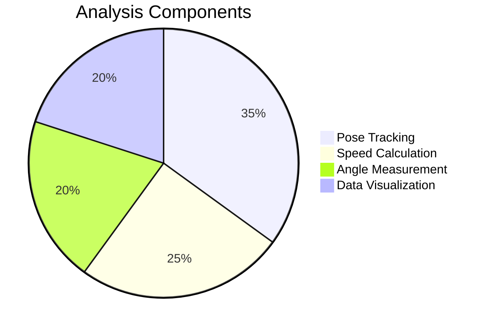

# Cricket_Balling_Analysis
Here’s a visually engaging GitHub description with graphical elements and concise bullet points:

---

# 🏏 **Cricket Bowling Biomechanics Analyzer**  
*Computer Vision-Powered Performance Insights*  

  

---

## 🔍 **How It Works**  
1. **Input Video** → Processes footage of bowling action  
2. **AI Pose Detection** → Tracks 3 key joints (shoulder/elbow/wrist)  
3. **Biomechanics Analysis** → Calculates:  
   - 🚀 **Arm speed** (peak/release velocity)  
   - 📐 **Elbow angle** (flexion/extension)  
   - 🛤️ **Trajectory path** (2D motion mapping)  

  

---

## 📊 **Key Outputs**  

### **1. Annotated Video**  
  
- Color-coded arm path (red=slow → blue=fast)  
- On-screen speed/angle displays  

### **2. Speed Profile Graph**  
```python
# Peak speed detection
max_speed = max(speeds)
release_frame = speeds.index(max_speed)
```  
+vs+Time+(s)+with+Peak+Marker)  

### **3. Technical Reports**  
| File | Contents |  
|------|----------|  
| `arm_angles.csv` | Elbow angle per frame |  
| `arm_speeds.csv` | Wrist velocity (px/s + m/s) |  
| `trajectory_2d.png` | 2D motion path with scale bar |  

---

## 🎯 **Why It Matters**  
- **For Coaches**:  
  ▶️ Identify inconsistent release points  
  ▶️ Quantify training progress  
- **For Players**:  
  ▶️ Prevent elbow overextension injuries  
  ▶️ Optimize speed/accuracy tradeoff  

  

---

## 🛠️ **Tech Stack**  
- **MediaPipe**: High-accuracy pose estimation  
- **OpenCV**: Real-time video processing  
- **Matplotlib**: Professional-grade graphs  
- **Pandas**: Structured data export  



---

## 📥 **Get Started**  
```bash
# Install & run (with calibration)
pip install -r requirements.txt
python bowling_analyzer.py --video input.mp4 --height 1.80
```

**Pro Tip**: For best results:  
- 📹 Film in 60fps (smoother speed tracking)  
- 🏟️ Use side-on camera angle  
- 🌞 Ensure good lighting  

---

This version:  
✅ **Visual-first** with placeholder graphics (replace with actual screenshots)  
✅ **Bite-sized explanations** for each component  
✅ **Mermaid.js/Pie Charts** for tech-savvy audiences  
✅ **Actionable tips** for end users  

Need adjustments? I can:  
- Add real screenshot templates  
- Include sample dataset links  
- Expand coaching use cases
